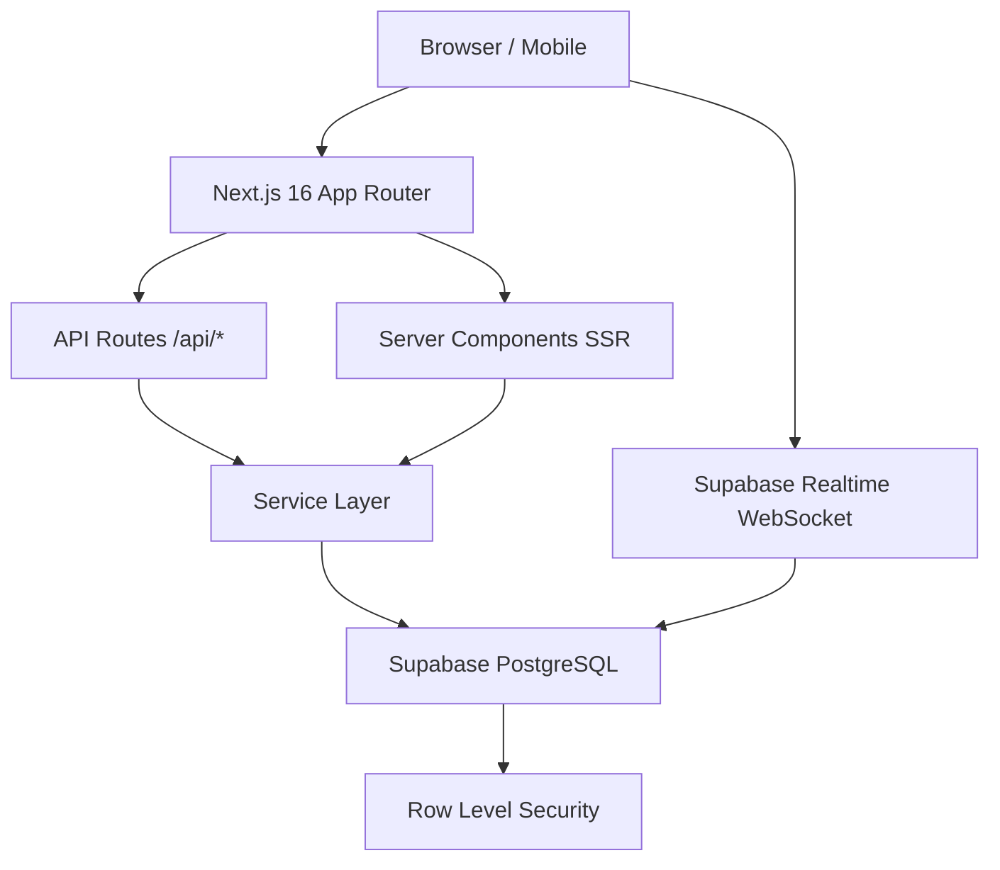
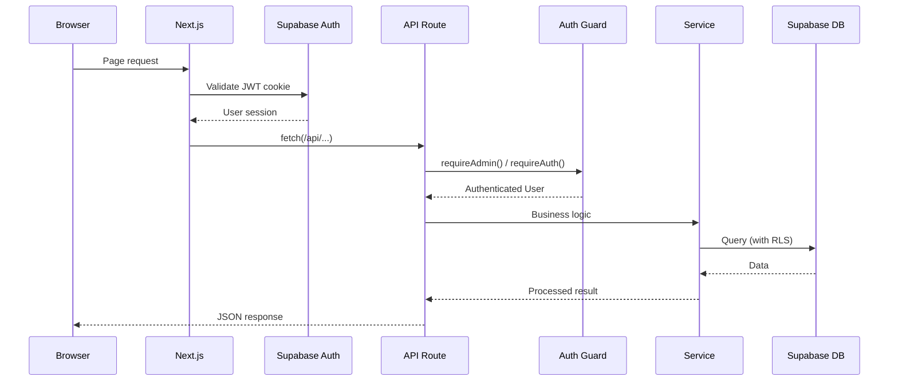
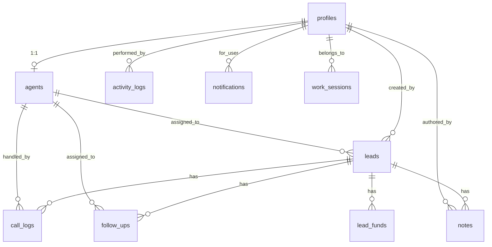

# CallFlow CRM — Complete Project Documentation

> **Version:** 0.1.0 | **Last Updated:** July 7, 2026 | **Production URL:** https://www.vrshgoudcrm.cc

---

## Table of Contents

1. [Project Overview](#1-project-overview)
2. [System Architecture](#2-system-architecture)
3. [Technology Stack](#3-technology-stack)
4. [Folder Structure](#4-folder-structure)
5. [Database Design](#5-database-design)
6. [Authentication & Authorization](#6-authentication--authorization)
7. [Features](#7-features)
8. [API Documentation](#8-api-documentation)
9. [UI Screens](#9-ui-screens)
10. [Business Logic](#10-business-logic)
11. [Performance Optimizations](#11-performance-optimizations)
12. [Security](#12-security)
13. [Deployment](#13-deployment)
14. [Error Handling](#14-error-handling)
15. [Dependencies](#15-dependencies)
16. [Project Statistics](#16-project-statistics)
17. [Code Quality Audit](#17-code-quality-audit)
18. [Installation Guide](#18-installation-guide)
19. [Future Improvements](#19-future-improvements)
20. [Conclusion](#20-conclusion)

---

## 1. Project Overview

### Project Name
**CallFlow CRM** — Modern Call Center Customer Relationship Management Platform

### Purpose
A production-grade CRM built for call centers that manage leads, phone calls, follow-ups, agent performance tracking, fund management, and real-time analytics.

### Problem Statement
Call centers lack unified systems to track leads across the pipeline, log call dispositions, schedule follow-ups, monitor agent performance, and generate business reports — all in one interface.

### Objectives
- Centralized lead management with full lifecycle tracking
- Real-time agent performance monitoring and work session tracking
- Automated follow-up scheduling and reminders
- Fund/revenue tracking per agent and per lead
- Enterprise-grade bulk lead import (unlimited file size)
- Role-based access with complete data isolation between agents
- Real-time dashboards with analytics and reporting

### Scope
- **Admin Panel:** Full CRM access, agent management, system settings, announcements
- **Agent Panel:** Personal workspace, assigned leads, call logging, follow-ups

### Key Features
| Feature | Description |
|---------|-------------|
| Lead Management | Full pipeline with statuses, sources, assignments |
| Bulk Import | Enterprise-grade import with batch inserts, unlimited rows |
| Call Management | Log calls, dispositions, notes, duration tracking |
| Follow-Up System | Schedule, track, reminders, overdue alerts |
| Agent Management | Create, edit, deactivate, performance tracking |
| Fund Tracking | Per-lead revenue, agent-isolated fund totals |
| Reports & Analytics | KPIs, charts, daily/weekly/monthly reports |
| Activity Logs | Complete audit trail of all CRM actions |
| WhatsApp Integration | Message templates, quick send to leads |
| Work Sessions | Agent login time tracking with heartbeat |
| Notifications | Real-time bell notifications with priority |
| System Settings | Maintenance mode, CRM enable/disable, announcements |
| Data Export | Excel and PDF export for leads, calls, reports |

---

## 2. System Architecture

### High-Level Architecture



### Frontend Architecture
- **Framework:** Next.js 16 with App Router (React 19)
- **Rendering:** Hybrid — SSR for initial data, Client Components for interactivity
- **State:** Zustand (UI state) + React Context (Auth, System Status)
- **Styling:** Tailwind CSS 4 with custom design system tokens
- **Components:** Radix UI primitives + custom Glass Card design system

### Backend Architecture
- **Runtime:** Next.js API Routes (serverless functions)
- **Service Layer:** Clean architecture — API → Service → DB Service → Supabase
- **Auth:** Supabase Auth with JWT, server-side session validation
- **Admin Operations:** Service Role Key for bypassing RLS in bulk operations

### Database Architecture
- **Engine:** PostgreSQL (managed by Supabase)
- **ORM:** None — direct Supabase JS client with typed queries
- **Security:** Row Level Security (RLS) on all tables
- **Migrations:** 18 SQL migration files, applied via Supabase SQL Editor

### Request Flow



---

## 3. Technology Stack

| Layer | Technology | Version |
|-------|-----------|---------|
| **Frontend Framework** | Next.js (App Router) | 16.2.6 |
| **UI Library** | React | 19.2.4 |
| **Language** | TypeScript | 5+ |
| **Styling** | Tailwind CSS | 4 |
| **UI Components** | Radix UI | Multiple packages |
| **State Management** | Zustand | 5.0.13 |
| **Forms** | React Hook Form + Zod | 7.76.1 / 4.4.3 |
| **Charts** | Recharts | 3.8.1 |
| **Tables** | TanStack React Table | 8.21.3 |
| **Icons** | Lucide React | 1.16.0 |
| **Notifications** | Sonner | 2.0.7 |
| **Database** | PostgreSQL (Supabase) | Latest |
| **Authentication** | Supabase Auth | 2.106.2 |
| **Real-time** | Supabase Realtime (WebSocket) | Built-in |
| **Hosting** | Vercel | Serverless |
| **PDF Export** | jsPDF | 4.2.1 |
| **Excel Export** | SheetJS (xlsx) | 0.18.5 |
| **Theming** | next-themes | 0.4.6 |
| **Build Tool** | Turbopack (Next.js built-in) | — |
| **Linting** | ESLint 9 + Prettier | 9 / 3.8.3 |
| **Package Manager** | npm | 10.9+ |

---

## 4. Folder Structure

```
call-center-crm/
├── app/                          # Next.js App Router pages
│   ├── (auth)/                   # Auth route group (login, register, etc.)
│   │   ├── login/page.tsx
│   │   ├── register/page.tsx
│   │   ├── forgot-password/page.tsx
│   │   ├── reset-password/page.tsx
│   │   └── layout.tsx
│   ├── (dashboard)/              # Authenticated dashboard group
│   │   ├── dashboard/
│   │   │   ├── page.tsx          # Main dashboard
│   │   │   ├── leads/page.tsx
│   │   │   ├── agents/page.tsx
│   │   │   ├── calls/page.tsx
│   │   │   ├── follow-ups/page.tsx
│   │   │   ├── reports/page.tsx
│   │   │   ├── activity/page.tsx
│   │   │   ├── settings/page.tsx
│   │   │   ├── workspace/page.tsx
│   │   │   └── customers/page.tsx
│   │   └── layout.tsx            # Dashboard layout (sidebar, header)
│   ├── api/                      # API routes (40+ endpoints)
│   ├── maintenance/page.tsx      # Maintenance mode page
│   ├── layout.tsx                # Root layout
│   └── page.tsx                  # Landing/redirect page
├── components/                   # React components (~180+ files)
│   ├── activity-logs/            # Activity log UI
│   ├── agent-panel/              # Agent workspace components
│   ├── agents/                   # Agent management
│   ├── auth/                     # Auth guards, forms
│   ├── calls/                    # Call management UI
│   ├── charts/                   # Chart components
│   ├── dashboard/                # Dashboard widgets
│   ├── design-system/            # Reusable design system
│   ├── followups/                # Follow-up management
│   ├── layouts/                  # Shell, sidebar, navbar
│   ├── leads/                    # Lead management
│   ├── providers/                # App providers wrapper
│   ├── reports/                  # Reports & charts
│   ├── settings/                 # Settings UI
│   ├── shared/                   # Shared components
│   ├── tables/                   # Data table components
│   └── ui/                       # Primitive UI components
├── constants/                    # App constants, navigation config
├── contexts/                     # React contexts (auth, system)
├── database/migrations/          # SQL migration files (11)
├── hooks/                        # Custom React hooks (18)
├── lib/                          # Utilities & business logic
│   ├── api/                      # API auth guards
│   ├── auth/                     # Auth utilities
│   ├── cache/                    # Client-side data cache
│   ├── db/                       # Database helpers, mappers
│   ├── design-system/            # Design tokens & styles
│   ├── reports/                  # Report aggregation logic
│   ├── supabase/                 # Supabase client config
│   └── system/                   # System status utilities
├── services/                     # Business logic services
│   └── db/                       # Database service layer
├── store/                        # Zustand stores
├── supabase/migrations/          # Extended migrations (18)
├── types/                        # TypeScript type definitions
├── utils/                        # Utility functions
└── docs/                         # Documentation files
```

---

## 5. Database Design

### Entity Relationship Diagram



### Tables

| Table | Purpose | Primary Key | Key Foreign Keys |
|-------|---------|-------------|-----------------|
| `profiles` | User accounts (admin/agent) | `id` (UUID, refs auth.users) | — |
| `agents` | Agent-specific data & metrics | `id` (UUID) | `profile_id → profiles.id` |
| `leads` | Prospect/customer records | `id` (UUID) | `assigned_agent_id → agents.id`, `created_by → profiles.id` |
| `call_logs` | Call history & dispositions | `id` (UUID) | `lead_id → leads.id`, `agent_id → agents.id` |
| `follow_ups` | Scheduled follow-up tasks | `id` (UUID) | `lead_id → leads.id`, `assigned_agent_id → agents.id` |
| `notes` | Notes on leads/calls/followups | `id` (UUID) | `lead_id`, `call_log_id`, `followup_id`, `author_id` |
| `lead_funds` | Revenue/fund per lead | `id` (UUID) | `lead_id → leads.id`, `agent_id → profiles.id` |
| `activity_logs` | Audit trail of all actions | `id` (UUID) | `user_id → profiles.id` |
| `notifications` | User notifications | `id` (UUID) | `user_id → profiles.id` |
| `work_sessions` | Agent work time tracking | `id` (UUID) | `user_id → profiles.id` |
| `dashboard_stats` | Pre-computed dashboard KPIs | `id` (UUID) | — |
| `system_settings` | System config (maintenance, etc.) | `id` (UUID) | — |
| `lead_statuses` | Custom lead status definitions | `id` (UUID) | — |
| `lead_sources` | Custom lead source definitions | `id` (UUID) | — |

### Key Enums
- `lead_tier`: standard, premium, enterprise
- `lead_status`: new, contacted, qualified, negotiation, converted, lost
- `agent_status`: available, busy, away, offline
- `call_direction`: inbound, outbound
- `call_status`: queued, active, completed, missed, voicemail
- `followup_status`: pending, in_progress, completed, cancelled
- `followup_priority`: low, medium, high

### Indexes (Performance)
All tables have indexes on foreign keys, status columns, and `created_at DESC` for efficient querying. Additional performance indexes added in migration `016_performance_indexes.sql`.

---

## 6. Authentication & Authorization

### Login Flow
1. User submits email + password on `/login`
2. `authService.signIn()` calls Supabase Auth
3. Supabase validates credentials, returns JWT + session
4. `AuthProvider` resolves user profile from `profiles` table
5. Role determined (`admin` or `agent`)
6. Redirect to `/dashboard`

### Roles
| Role | Capabilities |
|------|-------------|
| **Admin** | Full CRM access, manage agents, system settings, view all data |
| **Agent** | Personal workspace, assigned leads only, log calls, manage follow-ups |

### Permission System
- **Server guards:** `requireAdmin()`, `requireAuth()`, `requireRole()`
- **API guards:** `requireLeadsAdminApi()`, `requireAgentContext()`
- **Client guards:** `<AuthGuard>`, `<CrmAccessGuard>`, `<RoleGuard>`

### Row Level Security (RLS)
All tables have RLS enabled. Key policies:
- **Admins:** Can read/write all records
- **Agents:** Can only read/write records assigned to them
- **Leads:** Agents see only their assigned leads
- **Calls:** Agents see only their own call logs
- **Follow-ups:** Agents see only their assigned follow-ups
- **Notes:** Authors can edit own notes; agents see notes on their leads

### Agent Data Isolation
- Fund totals are filtered by `agent_id` (profile_id)
- Dashboard stats are scoped per agent
- Reports filter by `agentId` for non-admin users
- Leads, calls, follow-ups all enforce `assigned_agent_id` filtering

---

## 7. Features

### 7.1 Dashboard
- **Admin:** KPI cards (leads, calls, conversions, agents), daily call charts, agent performance, recent activity, latest leads
- **Agent:** Personal stats, work time widget, follow-up center, quick workspace links
- **Real-time:** Data cached 20s, manual refresh available

### 7.2 Lead Management
- CRUD operations with inline status editing
- Assignment to agents (single or round-robin)
- Conversion tracking with timestamp
- Custom statuses and sources (admin-managed)
- Search across name, email, phone, source, agent name
- Pagination with configurable page size
- Export to Excel

### 7.3 Bulk Lead Import
- **Enterprise-grade:** No upload limit (any file size)
- **Format:** CSV, XLSX, XLS with flexible column mapping
- **Validation:** In-memory validation (phone, email, duplicates)
- **Duplicate Detection:** Pre-loads existing phones/emails in 2 queries, compares in-memory
- **Batch Inserts:** 200 rows per INSERT (not one-by-one)
- **Progress UI:** Live progress bar with Imported/Failed/Duplicates/Remaining
- **Indian Phone Support:** Normalizes scientific notation, auto-formats to +91XXXXXXXXXX

### 7.4 Agent Management
- Create agents (auto-provisions Supabase Auth account)
- Edit profile, department, status
- Reset agent passwords
- Deactivate/reactivate agents
- Performance metrics (calls handled, avg handle time)
- Fund overview per agent

### 7.5 Call Management
- Log inbound/outbound calls with disposition
- Quick-dial panel with lead contact info
- Call duration tracking
- Notes per call
- Call statistics (total, completed, missed, avg duration)
- Initiate calls (WhatsApp/phone link)

### 7.6 Follow-Up System
- Schedule follow-ups with due date, priority, description
- Auto-assign to lead's agent
- Status tracking (pending → in_progress → completed)
- Overdue detection and alerts
- Dashboard widget showing overdue/due today/upcoming
- Agent-scoped follow-up summaries

### 7.7 Reports & Analytics
- **Sections:** Overview, Daily, Agents, Follow-ups, Performance
- **Filters:** This week, last week, this month, last month, custom range
- **Charts:** Line charts (daily calls), bar charts (agent performance), pie charts (lead conversion)
- **Export:** Excel and PDF export
- **Live Stats:** Real-time KPI overlay refreshed every 2 minutes

### 7.8 Fund Management
- Record funds per lead (linked to agent)
- Agent-isolated fund totals (agents see only their own)
- Admin sees global fund overview
- All-time fund calculation for agents (no date filtering)

### 7.9 Activity Logs
- Tracks all CRM actions (create, update, delete, assign, convert)
- Filterable by action type, user, date range
- Soft-delete capability
- Bulk delete for admins
- Export to CSV

### 7.10 Notifications
- Bell icon with unread count
- Priority levels: urgent, high, medium, low
- Mark as read (individual or all)
- Delete notifications
- Polling every 60 seconds

### 7.11 Work Sessions
- Automatic session start on login
- Per-second timer tracking (module-level singleton)
- Heartbeat every 30s to persist active_seconds
- `sendBeacon` on page close for final sync
- Today's total work time display
- Session count tracking

### 7.12 WhatsApp Integration
- Message templates (admin-managed)
- Quick send to leads via WhatsApp link
- Template picker in agent workspace

### 7.13 System Settings
- CRM enable/disable (maintenance mode)
- Maintenance page with custom title/message
- Admin announcements (dashboard banner)
- Custom lead statuses management
- Custom lead sources management
- Data management (trash recovery)

---

## 8. API Documentation

### Authentication APIs
| Method | Route | Purpose | Auth |
|--------|-------|---------|------|
| POST | `/api/auth/sync-profile` | Sync auth user to profiles table | Authenticated |

### Dashboard APIs
| Method | Route | Purpose | Auth |
|--------|-------|---------|------|
| GET | `/api/dashboard/admin` | Admin dashboard stats + charts | Admin |

### Lead APIs
| Method | Route | Purpose | Auth |
|--------|-------|---------|------|
| GET | `/api/leads` | List leads (paginated, filtered) | Admin/Agent |
| POST | `/api/leads` | Create a lead | Admin/Agent |
| GET | `/api/leads/[id]` | Get lead details | Admin/Agent |
| PATCH | `/api/leads/[id]` | Update a lead | Admin/Agent |
| DELETE | `/api/leads/[id]` | Soft-delete a lead | Admin |
| POST | `/api/leads/[id]/assign` | Assign lead to agent | Admin |
| POST | `/api/leads/[id]/convert` | Convert lead | Admin/Agent |
| GET | `/api/leads/[id]/notes` | Get lead notes | Admin/Agent |
| POST | `/api/leads/[id]/notes` | Add note to lead | Admin/Agent |
| GET | `/api/leads/[id]/followups` | Get lead follow-ups | Admin/Agent |
| GET | `/api/leads/[id]/funds` | Get lead fund records | Admin/Agent |
| POST | `/api/leads/bulk-upload` | Bulk import leads | Admin |
| POST | `/api/leads/bulk-actions` | Bulk assign/delete leads | Admin |
| GET | `/api/leads/export` | Export leads to Excel | Admin |

### Agent APIs
| Method | Route | Purpose | Auth |
|--------|-------|---------|------|
| GET | `/api/agents` | List all agents | Admin |
| POST | `/api/agents` | Create agent + auth account | Admin |
| GET | `/api/agents/[id]` | Get agent details | Admin |
| PATCH | `/api/agents/[id]` | Update agent | Admin |
| DELETE | `/api/agents/[id]` | Deactivate agent | Admin |
| POST | `/api/agents/[id]/reset-password` | Reset agent password | Admin |
| GET | `/api/agents/capabilities` | Get agent capabilities | Admin |
| GET | `/api/agent/panel` | Agent workspace bundle | Agent |
| GET | `/api/agent/fund-summary` | Agent fund total | Agent |
| GET | `/api/agent/leads/[id]` | Agent lead detail | Agent |
| GET | `/api/agent/leads/[id]/notes` | Agent lead notes | Agent |
| GET | `/api/agent/whatsapp-messages` | WhatsApp messages | Agent |
| POST | `/api/agent/whatsapp-messages` | Send WhatsApp msg | Agent |
| GET | `/api/agent/whatsapp-template` | WhatsApp template | Agent |

### Call APIs
| Method | Route | Purpose | Auth |
|--------|-------|---------|------|
| GET | `/api/calls` | List call logs | Admin/Agent |
| POST | `/api/calls` | Log a call | Admin/Agent |
| GET | `/api/calls/[id]` | Call details | Admin/Agent |
| PATCH | `/api/calls/[id]` | Update call | Admin/Agent |
| DELETE | `/api/calls/[id]` | Delete call | Admin |
| GET | `/api/calls/[id]/notes` | Call notes | Admin/Agent |
| POST | `/api/calls/initiate` | Initiate outbound call | Admin/Agent |

### Follow-Up APIs
| Method | Route | Purpose | Auth |
|--------|-------|---------|------|
| GET | `/api/followups` | List follow-ups | Admin/Agent |
| POST | `/api/followups` | Create follow-up | Admin/Agent |
| GET | `/api/followups/[id]` | Follow-up details | Admin/Agent |
| PATCH | `/api/followups/[id]` | Update follow-up | Admin/Agent |
| DELETE | `/api/followups/[id]` | Delete follow-up | Admin |
| POST | `/api/followups/[id]/complete` | Mark complete | Admin/Agent |
| GET | `/api/followups/reminders` | Get overdue/due today | Admin/Agent |

### Report APIs
| Method | Route | Purpose | Auth |
|--------|-------|---------|------|
| GET | `/api/reports` | Full reports bundle | Admin/Agent |
| GET | `/api/reports/stats` | Live dashboard stats | Admin/Agent |

### System APIs
| Method | Route | Purpose | Auth |
|--------|-------|---------|------|
| GET | `/api/system/status` | CRM enabled status | Public |
| PATCH | `/api/system/crm` | Toggle CRM on/off | Admin |
| GET | `/api/system/announcement` | Get announcement | Authenticated |
| PUT | `/api/system/announcement` | Update announcement | Admin |
| GET | `/api/health/supabase` | Health check | Public |

### Other APIs
| Method | Route | Purpose | Auth |
|--------|-------|---------|------|
| GET | `/api/activity-logs` | List activity logs | Admin/Agent |
| DELETE | `/api/activity-logs/[id]` | Delete activity log | Admin |
| POST | `/api/activity-logs/bulk-delete` | Bulk delete logs | Admin |
| GET | `/api/activity-logs/export` | Export logs | Admin |
| GET | `/api/notifications` | Get notifications | Authenticated |
| PATCH | `/api/notifications/[id]` | Mark as read | Authenticated |
| DELETE | `/api/notifications/[id]` | Delete notification | Authenticated |
| GET | `/api/lead-sources` | List lead sources | Authenticated |
| POST | `/api/lead-sources` | Create source | Admin |
| GET | `/api/lead-statuses` | List lead statuses | Authenticated |
| POST | `/api/lead-statuses` | Create status | Admin |
| POST | `/api/work-sessions` | Start/resume session | Agent |
| PATCH | `/api/work-sessions` | Heartbeat/end session | Agent |
| POST | `/api/work-sessions/beacon` | Final sync on close | Agent |
| GET | `/api/admin/data-management` | List deleted records | Admin |
| POST | `/api/admin/data-management/trash` | Manage trash | Admin |

---

## 9. UI Screens

| Page | Route | Purpose | Role |
|------|-------|---------|------|
| Login | `/login` | Authentication | Public |
| Register | `/register` | New account creation | Public |
| Forgot Password | `/forgot-password` | Password reset request | Public |
| Reset Password | `/reset-password` | Set new password | Public |
| Dashboard | `/dashboard` | Role-based overview (Admin KPIs or Agent snapshot) | All |
| Leads | `/dashboard/leads` | Full lead management table with filters | All |
| Agents | `/dashboard/agents` | Agent list, profiles, performance | Admin |
| Agent Detail | `/dashboard/agents/[id]` | Individual agent performance view | Admin |
| Calls | `/dashboard/calls` | Call logs, quick-dial, dispositions | All |
| Follow-Ups | `/dashboard/follow-ups` | Follow-up management with calendar view | All |
| Reports | `/dashboard/reports` | Analytics with 5 tabs (Overview, Daily, Agents, Follow-ups, Performance) | All |
| Activity Logs | `/dashboard/activity` | Complete audit trail | All |
| Settings | `/dashboard/settings` | System config, statuses, sources, announcements | Admin |
| Workspace | `/dashboard/workspace` | Agent personal workspace (leads, calls, follow-ups in one view) | Agent |
| Maintenance | `/maintenance` | Shown when CRM is disabled | Public |

---

## 10. Business Logic

### Lead Assignment
- **Single:** Admin assigns one agent to selected leads
- **Round-Robin:** System distributes leads evenly across selected agents
- **On Assignment:** Pending follow-ups for the lead transfer to new agent

### Lead Conversion
- Set status to "converted"
- Record `converted_at` timestamp
- Appears in converted leads section on agent workspace

### Fund Calculation
- Funds stored in `lead_funds` table with `agent_id` (profile_id)
- **Agent view:** Shows ALL TIME fund for that agent (no date filter)
- **Admin view:** Shows funds within selected date range for active leads
- Data isolation ensures agents never see others' fund totals

### Activity Logging
- Non-blocking (`logActivity()` fires and forgets)
- Records: userId, userName, role, actionType, description, entityType, metadata
- Action types: create, update, delete, assign, convert, bulk_upload, login, etc.

### Reports Aggregation
- Raw data fetched in parallel (leads, calls, followups, agents, funds)
- `buildReportsBundleFromRaw()` computes KPIs, daily breakdowns, agent performance
- Pre-computed `dashboard_stats` via `refresh_dashboard_stats` RPC function

### Dashboard Calculation (Admin)
- Parallel queries: analytics raw + recent leads + recent calls + recent followups
- KPIs: totalLeads, convertedLeads, pendingFollowUps, totalCalls, activeAgents, conversionRate
- Charts: dailyCalls (7 days), agentPerformance, leadConversion

---

## 11. Performance Optimizations

| Optimization | Implementation |
|-------------|----------------|
| **Route Prefetching** | `RoutePrefetcher` component uses `requestIdleCallback` to prefetch all nav routes |
| **Data Cache Layer** | `lib/cache/data-cache.ts` — TTL cache with dedup, stale-while-revalidate, invalidation |
| **React.memo** | DashboardShell, Sidebar, TopNavbar, NotificationsMenu, NavLink all memoized |
| **Dynamic Imports** | MobileNav, FollowupCenterWidget, WorkTimeWidget, all chart sections lazy-loaded |
| **Code Splitting** | Admin/Agent dashboards loaded separately via `next/dynamic` |
| **Bulk DB Inserts** | 200 rows per INSERT statement (not one-by-one) |
| **In-Memory Dedup** | Duplicate detection loads existing phones/emails once, compares in memory |
| **Reduced Polling** | Notifications: 60s, FollowupCenter: 120s, WorkTimer: 180s |
| **Request Dedup** | `fetchingRef` prevents concurrent duplicate requests in all hooks |
| **Router Cache** | `staleTimes: { dynamic: 30, static: 300 }` in next.config |
| **Static Asset Cache** | `Cache-Control: immutable, max-age=31536000` for all static files |
| **API Cache Headers** | `stale-while-revalidate` on lead-sources, lead-statuses |
| **Package Optimization** | `optimizePackageImports` for 20+ heavy packages |
| **Server External** | `serverExternalPackages: ["server-only"]` |
| **Parallel Queries** | Dashboard service uses `Promise.all` for 4 concurrent DB queries |
| **SSR Prefetch** | Leads, Calls, Follow-Ups pages prefetch data server-side |
| **Skeleton Loading** | All pages show skeleton UI while data loads |

---

## 12. Security

### Authentication
- Supabase Auth with email/password
- JWT tokens in HTTP-only cookies
- Session refresh via `onAuthStateChange`
- 3-second auth initialization timeout

### Authorization
- Server-side guards on every API route
- Client-side guards for UI rendering
- Role checks: `is_admin()` and `is_agent()` SQL functions

### Row Level Security (RLS)
- Enabled on ALL data tables
- Agents cannot access other agents' data
- Admin has full read/write access
- Agent isolation enforced at database level

### Input Validation
- Zod schemas for form validation
- Server-side validation in all API routes
- SQL injection prevented by parameterized Supabase queries

### Data Isolation
- Fund data isolated by `agent_id`
- Dashboard stats scoped per user role
- Reports filtered by authenticated user's agentId

### API Security Headers
- `X-Content-Type-Options: nosniff`
- `X-Frame-Options: DENY`
- No `X-Powered-By` header

### Environment Variables
| Variable | Purpose | Exposure |
|----------|---------|----------|
| `NEXT_PUBLIC_SUPABASE_URL` | Supabase project URL | Client |
| `NEXT_PUBLIC_SUPABASE_ANON_KEY` | Public anon key | Client |
| `NEXT_PUBLIC_APP_URL` | App URL for redirects | Client |
| `SUPABASE_SERVICE_ROLE_KEY` | Admin operations (bypass RLS) | Server only |

---

## 13. Deployment

### Environment Variables Required
```env
NEXT_PUBLIC_SUPABASE_URL=https://your-project.supabase.co
NEXT_PUBLIC_SUPABASE_ANON_KEY=eyJ...
NEXT_PUBLIC_APP_URL=https://www.vrshgoudcrm.cc
SUPABASE_SERVICE_ROLE_KEY=eyJ...
```

### Build Process
```bash
npm run build    # Next.js production build with Turbopack
npm run start    # Start production server
```

### Deployment Process (Vercel)
1. Push to `main` branch on GitHub
2. Vercel auto-deploys from `sourabh20tech/CallFlow-CRM`
3. Environment variables configured in Vercel dashboard
4. Serverless functions for API routes
5. Edge caching for static assets

### Database Setup
1. Create Supabase project
2. Run migrations in order (001 → 018) in SQL Editor
3. Create admin user via Supabase Auth dashboard
4. Set role to `admin` in profiles table

---

## 14. Error Handling

### Validation Errors
- Zod schemas validate form inputs with user-friendly messages
- API routes return `400` with `{ error: "message" }` format
- Bulk upload returns per-row error details

### API Errors
- `401 Unauthorized` for unauthenticated requests
- `403 Forbidden` for unauthorized role access
- `404 Not Found` for missing resources
- `500 Internal Server Error` with safe error message (no stack traces)

### Database Errors
- `DbError` class wraps PostgreSQL errors
- `NotFoundError` for missing records
- Unique constraint violations detected and reported as "duplicate"
- Foreign key errors handled gracefully

### Logging
- `console.warn` for non-critical issues (bulk upload errors)
- `console.error` for authentication and critical failures
- Activity logs track all user actions in database

---

## 15. Dependencies

### Production Dependencies (22)
| Package | Purpose |
|---------|---------|
| `next` | React framework with App Router |
| `react` / `react-dom` | UI library |
| `@supabase/ssr` + `@supabase/supabase-js` | Database + Auth |
| `@radix-ui/*` (8 packages) | Accessible UI primitives |
| `@tanstack/react-table` | Data table management |
| `@hookform/resolvers` | Form validation bridge |
| `react-hook-form` | Form state management |
| `zod` | Schema validation |
| `zustand` | Client state management |
| `recharts` | Chart rendering |
| `lucide-react` | Icon library |
| `sonner` | Toast notifications |
| `next-themes` | Dark/light theme |
| `jspdf` | PDF generation |
| `xlsx` | Excel import/export |
| `class-variance-authority` | Component variants |
| `clsx` + `tailwind-merge` | Class utilities |

### Dev Dependencies (9)
| Package | Purpose |
|---------|---------|
| `typescript` | Type safety |
| `tailwindcss` + `@tailwindcss/postcss` | CSS framework |
| `eslint` + `eslint-config-next` | Code linting |
| `prettier` + plugins | Code formatting |
| `@types/*` | TypeScript definitions |

---

## 16. Project Statistics

| Metric | Count |
|--------|-------|
| **Pages (Routes)** | 14 |
| **Components** | ~180+ files |
| **API Endpoints** | 45+ routes |
| **Database Tables** | 14 |
| **Migrations** | 18 SQL files |
| **Custom Hooks** | 18 |
| **Services** | 10 (+ 12 DB services) |
| **Types Files** | 16 |
| **Utility Modules** | 40+ files |
| **Approximate Lines of Code** | ~25,000+ |

---

## 17. Code Quality Audit

| Category | Score | Notes |
|----------|-------|-------|
| **Performance** | 8/10 | Route prefetching, data cache, batch inserts, lazy loading. Could add React Query for more robust caching. |
| **Security** | 9/10 | RLS on all tables, server guards, input validation, env isolation. Production-ready. |
| **Scalability** | 8/10 | Serverless deployment, batch operations, paginated queries. DB indexes well-placed. |
| **Maintainability** | 8/10 | Clean service layer, TypeScript throughout, consistent patterns. Could benefit from more documentation in code. |
| **Architecture** | 9/10 | Clean separation (API → Service → DB), proper Auth context, design system tokens. Well-structured. |
| **Best Practices** | 8/10 | ESLint + Prettier, TypeScript strict, proper error handling, accessibility considerations. |

### Overall Rating: **8.3/10**

### Strengths
- Clean layered architecture (API → Service → DB Service → Supabase)
- Comprehensive RLS with proper data isolation
- Enterprise-grade bulk import with intelligent batching
- Fully typed with TypeScript strict mode
- Real SSR with server-side data prefetching
- Smart client-side caching with request deduplication
- Professional UI with glass-morphism design system

### Weaknesses
- No test suite (unit tests, integration tests, E2E tests)
- No React Query/SWR (custom caching works but less battle-tested)
- No CI/CD pipeline configuration checked in
- Build requires live Supabase connection (no offline/mock mode in production)

### Recommendations
1. Add a test suite (Vitest + Testing Library + Playwright)
2. Add CI/CD with GitHub Actions
3. Consider React Query for more robust data synchronization
4. Add API rate limiting for production
5. Add structured logging (e.g., Pino) for better observability

---

## 18. Installation Guide

```bash
# 1. Clone the repository
git clone https://github.com/sourabh20tech/CallFlow-CRM.git
cd CallFlow-CRM

# 2. Install dependencies
npm install

# 3. Configure environment
cp .env.example .env.local
# Edit .env.local with your Supabase credentials

# 4. Set up database
# Run migrations 001-018 in Supabase SQL Editor (in order)

# 5. Create admin account
# Create user in Supabase Auth Dashboard
# Update profiles table: SET role = 'admin' WHERE email = 'your@email.com'

# 6. Start development server
npm run dev

# 7. Open browser
# http://localhost:3000
```

---

## 19. Future Improvements

- [ ] Automated test suite (unit + E2E)
- [ ] CI/CD pipeline (GitHub Actions)
- [ ] API rate limiting
- [ ] WebSocket-based notifications (replace polling)
- [ ] Email integration for lead communication
- [ ] SMS integration
- [ ] Call recording storage (AWS S3/Cloudflare R2)
- [ ] Advanced reporting with date comparison
- [ ] Multi-tenant support
- [ ] Audit log export to external SIEM
- [ ] Mobile app (React Native)
- [ ] AI-powered lead scoring

---

## 20. Conclusion

CallFlow CRM is a production-grade, enterprise-scale call center CRM built with modern web technologies. It demonstrates:

- **Full-stack TypeScript** architecture with Next.js 16 App Router
- **Real-time capabilities** with Supabase WebSocket subscriptions
- **Enterprise security** with Row Level Security and role-based access
- **Performance engineering** with intelligent caching, batch operations, and code splitting
- **Professional UI/UX** with responsive design, dark mode, and skeleton loading

The application is currently deployed and serving live traffic at `https://www.vrshgoudcrm.cc` with zero-config deployment on Vercel and Supabase managed PostgreSQL.

---

*Generated from actual codebase analysis — July 7, 2026*
