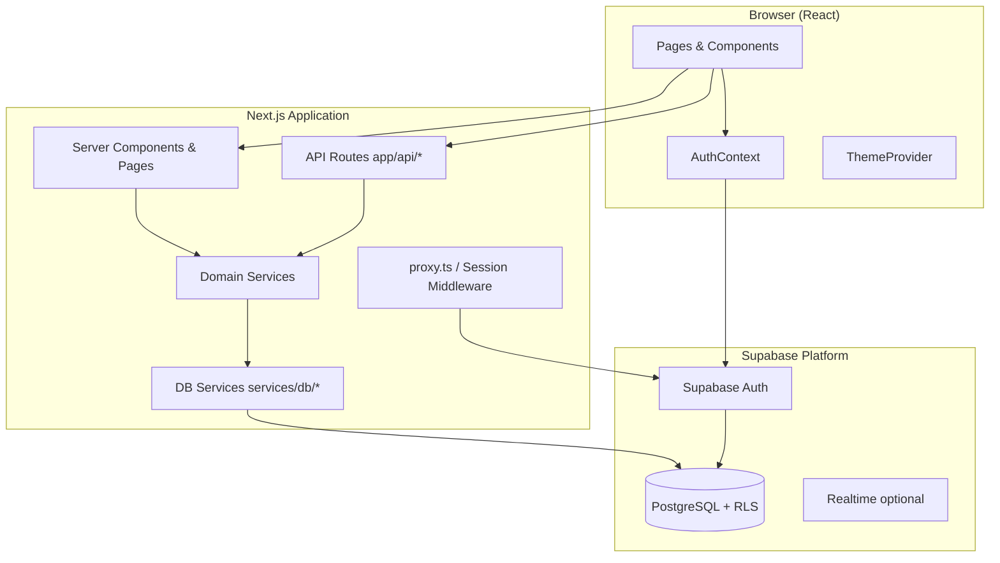
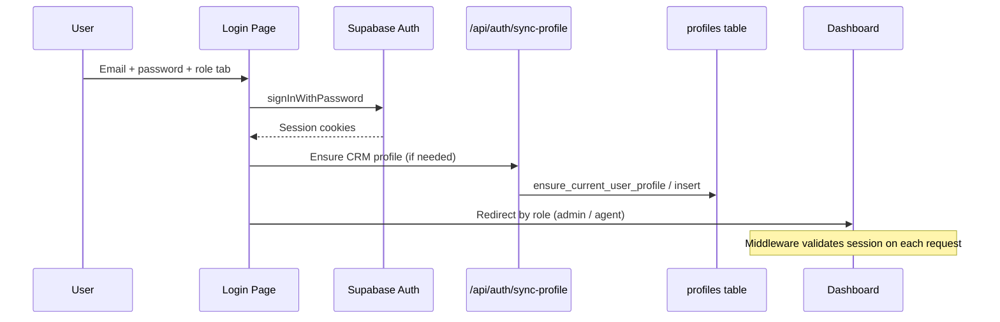
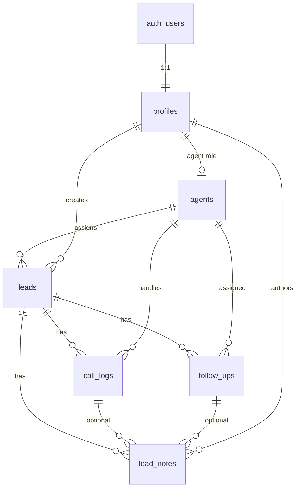
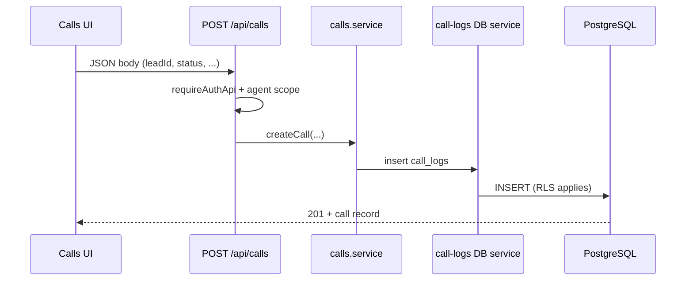
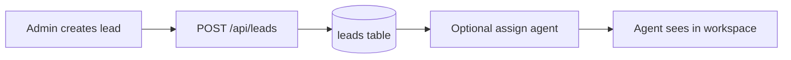

<div style="page-break-after: always;"></div>

# Cover Page

| Field | Detail |
|-------|--------|
| **Project Name** | CallFlow CRM |
| **Client / Organization** | VRSH GOUD SERVICES |
| **Version** | 0.1.0 |
| **Prepared By** | VRSH GOUD SERVICES — Development Team |
| **Document Type** | Client Project Report & Technical Documentation |
| **Date** | May 28, 2026 |
| **Platform** | Web Application (SaaS-style CRM) |
| **Status** | Production-ready (Supabase-backed deployment) |

---

# Executive Summary

## Project Overview

**CallFlow CRM** is a modern, full-stack Call Center Customer Relationship Management platform designed for operations teams that manage leads, agents, calls, and follow-ups in a single secure workspace. The application delivers separate experiences for **Administrators** and **Agents**, with real-time system controls, analytics, and professional glassmorphism UI.

The solution is built on **Next.js 16** (App Router), **TypeScript**, **Tailwind CSS v4**, and **Supabase** (PostgreSQL, Auth, Row Level Security). It is structured for deployment on **Vercel** with environment-based configuration and no runtime dependency on mock or demo data.

## Business Objective

- Centralize lead and call operations for inbound/outbound call center teams.
- Enforce **role-based access** so administrators control configuration and agents focus on assigned work.
- Improve conversion tracking, follow-up discipline, and operational visibility through dashboards and reports.
- Provide a maintainable, scalable foundation for future integrations (telephony, SMS, advanced analytics).

## Key Benefits

| Benefit | Description |
|---------|-------------|
| **Unified operations** | Leads, calls, follow-ups, and notes in one system |
| **Role separation** | Admin vs agent permissions at UI, middleware, API, and database layers |
| **Security by design** | Supabase Auth, RLS policies, server-only service role for admin APIs |
| **Operational control** | CRM on/off, maintenance mode, admin announcements |
| **Data governance** | Soft delete, trash, restore, and bulk cleanup for admins |
| **Actionable analytics** | Multi-tab reports with Excel and PDF export |
| **Agent productivity** | Dedicated workspace, WhatsApp quick-chat, call logging, reminders |
| **Deployment-ready** | Documented env vars, migrations, GitHub + Vercel workflow |

---

# Technology Stack

## Frontend

| Technology | Version / Notes | Role |
|------------|-----------------|------|
| **Next.js** | 16.2.6 (App Router) | Pages, layouts, API routes, SSR |
| **React** | 19.2.4 | UI components |
| **TypeScript** | 5.x | Type-safe application code |
| **Tailwind CSS** | v4 | Utility-first styling, design tokens |
| **ShadCN-style UI** | Radix primitives + custom design system | Buttons, dialogs, tables, tabs, sheets |
| **Recharts** | 3.x | Dashboard and report charts |
| **TanStack Table** | 8.x | Data grids (agents, calls) |
| **React Hook Form + Zod** | — | Form validation |
| **next-themes** | — | Light / dark / midnight themes |
| **Zustand** | — | Lightweight UI state |
| **Sonner** | — | Toast notifications |
| **Lucide React** | — | Iconography |
| **xlsx / jsPDF** | — | Report and lead export |

## Backend

| Technology | Role |
|------------|------|
| **Next.js API Routes** | REST-style handlers under `app/api/` |
| **Supabase JS (@supabase/ssr)** | Server and browser clients, cookie sessions |
| **Service layer** | `services/*.service.ts` + `services/db/*` |
| **Zod validators** | API input validation (e.g. data management) |

## Database

| Technology | Role |
|------------|------|
| **PostgreSQL (Supabase)** | Primary data store |
| **Row Level Security (RLS)** | Per-table access policies |
| **SQL migrations** | `database/migrations/` (source of truth) |
| **Supabase CLI mirror** | `supabase/migrations/` |

## Authentication

| Technology | Role |
|------------|------|
| **Supabase Auth** | Email/password sign-in, session cookies |
| **profiles table** | CRM role (`admin` \| `agent`) linked to `auth.users` |

## Deployment

| Platform | Role |
|----------|------|
| **GitHub** | Source control, CI-ready repository |
| **Vercel** | Recommended hosting for Next.js |
| **Supabase Cloud** | Database, auth, optional realtime |

---

# System Architecture

## High-Level Architecture



## Frontend ↔ Backend ↔ Database Flow

1. **User action** (e.g. update lead) triggers a client fetch to `/api/leads/[id]` or a server component loads data via a service.
2. **API route** validates session via `requireAuthApi`, `requireAdminApi`, or `requireAgentContextApi`.
3. **Domain service** (`leads.service.ts`) applies business rules and calls **DB service** (`services/db/leads.service.ts`).
4. **Supabase server client** executes queries against PostgreSQL; **RLS** enforces row access for direct client queries where used.
5. **Response** returns JSON to the UI; toasts and local state update the interface.

## Authentication Flow



**Post-login routing**

| Role | Default destination |
|------|---------------------|
| Admin | `/dashboard` |
| Agent | `/dashboard/workspace` |

## Role-Based Access Flow

```mermaid
flowchart TD
  A[HTTP Request] --> B{Authenticated?}
  B -->|No| C[Redirect /login]
  B -->|Yes| D{Route type}
  D -->|Admin-only UI| E{role = admin?}
  E -->|No| F[Redirect workspace / forbidden]
  E -->|Yes| G[Allow]
  D -->|Agent maintenance| H{CRM enabled?}
  H -->|No + agent| I[/maintenance]
  H -->|Yes or admin| G
  D -->|API| J[requireAuth / Admin / AgentContext]
  J --> K[Resource scope e.g. own lead]
```

**Enforcement layers**

| Layer | Implementation |
|-------|----------------|
| Edge / proxy | `proxy.ts` → `lib/supabase/middleware.ts` |
| Page layouts | `ProtectedRoute`, `RoleGuard`, `CrmAccessGuard` |
| Server pages | `requireAdmin()` on settings and agents |
| API | `lib/api/require-*.ts` |
| Database | PostgreSQL RLS policies |

---

# Database Documentation

## Core Tables (Application Contract)

The TypeScript contract in `types/database.ts` reflects the production schema target.

### `profiles`

| Column | Type | Notes |
|--------|------|-------|
| **id** | uuid | **PK**, FK → `auth.users(id)` |
| email | text | Required |
| full_name, phone, avatar_url | text | Optional |
| **role** | text | `admin` \| `agent` |
| created_at, updated_at | timestamptz | Audit |

### `agents`

| Column | Type | Notes |
|--------|------|-------|
| **id** | uuid | **PK** |
| **profile_id** | uuid | **FK** → profiles (unique) |
| department | text | Default `General` |
| status | enum | available, busy, away, offline |
| calls_handled, avg_handle_time_seconds | int | Metrics |
| satisfaction_score | numeric | 0–5 |
| is_active | boolean | Login gate for agents |
| deleted_at | timestamptz | Soft delete |
| created_at, updated_at | timestamptz | — |

### `leads`

| Column | Type | Notes |
|--------|------|-------|
| **id** | uuid | **PK** |
| full_name | text | Required |
| email, phone, company, source | text | Phone or email required (check) |
| tier | enum | standard, premium, enterprise |
| status | enum | new → converted / closed |
| **assigned_agent_id** | uuid | **FK** → agents |
| **created_by** | uuid | **FK** → profiles |
| converted_at, last_contacted_at, next_follow_up_at | timestamptz | Pipeline |
| metadata | jsonb | Extensible fields |
| deleted_at | timestamptz | Soft delete |

### `call_logs`

| Column | Type | Notes |
|--------|------|-------|
| **id** | uuid | **PK** |
| **lead_id** | uuid | **FK** → leads (cascade) |
| **agent_id** | uuid | **FK** → agents |
| direction | enum | inbound / outbound |
| status | enum | connected, busy, no_answer, etc. |
| duration_seconds | int | — |
| started_at, ended_at | timestamptz | — |
| summary, recording_url, external_call_id | text | Optional |
| **created_by** | uuid | **FK** → profiles |
| deleted_at | timestamptz | Soft delete |

### `follow_ups`

| Column | Type | Notes |
|--------|------|-------|
| **id** | uuid | **PK** |
| **lead_id** | uuid | **FK** → leads |
| **assigned_agent_id** | uuid | **FK** → agents |
| title, description | text | — |
| due_at | timestamptz | Required |
| status | enum | pending → completed / cancelled |
| priority | enum | low, medium, high |
| completed_at | timestamptz | Set by trigger when completed |
| **created_by** | uuid | **FK** → profiles |
| deleted_at | timestamptz | Soft delete |

### `lead_notes`

| Column | Type | Notes |
|--------|------|-------|
| **id** | uuid | **PK** |
| **lead_id** | uuid | **FK** → leads |
| **author_id** | uuid | **FK** → profiles |
| content | text | Required |
| is_pinned | boolean | — |
| call_log_id | uuid | Optional FK → call_logs |
| followup_id | uuid | Optional FK → follow_ups |
| deleted_at | timestamptz | Soft delete |

### `system_settings`

| Column | Type | Notes |
|--------|------|-------|
| **id** | uuid | **PK** |
| setting_key | text | Unique; global row `global` |
| crm_enabled | boolean | Master CRM switch |
| maintenance_mode | boolean | Synced with CRM flag |
| maintenance_title, maintenance_message | text | Maintenance page copy |
| admin_announcement_title, admin_announcement_message | text | Agent banner |
| updated_by | uuid | FK → profiles |

### Optional / Enterprise Tables (Migrations)

Present in `000_enterprise_production_setup.sql` and related migrations:

| Table | Purpose |
|-------|---------|
| `dashboard_stats` | Cached KPI snapshots by date / scope |
| `reports` | Stored report payloads |
| `activity_logs` | Audit trail for entity changes |

## Entity Relationship Diagram



## Row Level Security (RLS) Summary

RLS is enabled on CRM tables. Helper functions: `is_admin()`, `is_agent()`, `current_agent_id()`.

| Table | Admin | Agent | Notes |
|-------|-------|-------|-------|
| profiles | Read all; update own + admin rules | Read/update own | — |
| agents | Full management | Read/update own row | Soft-delete aware |
| leads | Full CRUD (non-deleted) | Read/update assigned or created | Insert requires auth |
| call_logs | Full access patterns | Own agent + lead access | — |
| follow_ups | Admin + assigned agent | Assigned / lead-linked | — |
| lead_notes | Admin + author + lead access | Author + lead access | Migration `011` |
| system_settings | Public read; admin update | Read-only | Drives maintenance |

## Migrations

14 SQL files under `database/migrations/` (001–011 plus enterprise rollup `000`). Mirror copies in `supabase/migrations/` for Supabase CLI.

**Apply in documented order** — see `database/README.md` and `docs/deployment-guide.md`.

---

# Features Implemented

## Admin Features

| Feature | Description | Primary routes / components |
|---------|-------------|----------------------------|
| **Dashboard** | Org KPIs, charts, recent activity, latest leads | `/dashboard`, `AdminDashboardOverview` |
| **User / Agent management** | Create, edit, deactivate, reset password | `/dashboard/agents`, `agents-management` |
| **Lead management** | CRUD, assign, export Excel | `/dashboard/leads`, `leads-management` |
| **Call management** | All agents’ calls, filters, edit/delete | `/dashboard/calls`, `calls-management` |
| **Follow-up management** | Schedule, filter by agent, complete | `/dashboard/follow-ups` |
| **Reports** | 7 analytics tabs, date filters, live stats | `/dashboard/reports`, `ReportsDashboard` |
| **CRM settings** | Role info, workspace metadata | `/dashboard/settings` |
| **System control** | Enable/disable CRM, maintenance copy | `CrmSystemControl` |
| **Announcements** | Title/message broadcast to agents | `AdminAnnouncementCard` |
| **Data management** | Bulk delete, cleanup, agent deactivate | `DataManagementSection` |
| **Soft delete / trash** | List, restore, permanent delete | `/api/admin/data-management/trash` |

## Agent Features

| Feature | Description | Primary routes / components |
|---------|-------------|----------------------------|
| **Dashboard** | Snapshot + announcement banner | `/dashboard`, `AgentDashboard` |
| **Workspace** | Assigned leads, today’s calls, follow-ups, converted | `/dashboard/workspace`, `AgentPanelDashboard` |
| **Lead handling** | View/update assigned leads, status actions | `my-leads-section`, agent lead APIs |
| **Call logging** | Log calls, timeline, quick dial | `today-calls-section`, `calls-management` |
| **Follow-ups** | Pending list, schedule, complete | `pending-followups-section` |
| **Notes** | Real-time lead notes panel | `lead-notes-panel`, `useLeadNotes` |
| **Status updates** | Lead and call disposition updates | `lead-status-actions`, `call-status-actions` |
| **WhatsApp quick chat** | `wa.me` links with templates | `WhatsAppChatButton` |
| **Reports** | Same analytics access as admin (auth-only API) | `/dashboard/reports` |

## Shared Features

- Theme toggle: **light**, **dark**, **midnight**
- Responsive sidebar + mobile sheet navigation
- Breadcrumb navigation
- Password reset flow (forgot / reset)
- Supabase health check endpoint
- Copyright branding: **CallFlow CRM © 2026**

---

# Authentication & Security

## Login System

- Email/password via Supabase Auth (`components/auth/login-form.tsx`).
- Role selector (Admin / Agent) validated against profile role after sign-in.
- Agents blocked from login when CRM is in maintenance (unless admin).
- Profile provisioning via `POST /api/auth/sync-profile` and RPC `ensure_current_user_profile`.

## Role-Based Permissions

| Capability | Admin | Agent |
|------------|-------|-------|
| Agents CRUD | Yes | No |
| Settings / data management | Yes | No |
| Lead create/delete/assign/export | Yes | No |
| Lead update (assigned) | Yes | Yes (own) |
| All calls view | Yes | Scoped |
| Reports | Yes | Yes |
| CRM toggle | Yes | No |
| Workspace | Redirected | Yes |

## Protected Routes

- **Public:** `/login`, `/register`, `/forgot-password`, `/reset-password`, `/maintenance`
- **Protected prefix:** `/dashboard/*`
- **Admin-only UI:** `/dashboard/agents`, `/dashboard/settings` (+ subpaths)

## Session Handling

- Cookie-based SSR sessions (`@supabase/ssr`).
- `proxy.ts` refreshes session and sets `x-user-role`, `x-crm-enabled` headers.
- Client `AuthProvider` listens to `onAuthStateChange`.
- Inactive agents rejected at login (`assertAgentCanAuthenticate`).

## Security Measures

| Measure | Implementation |
|---------|----------------|
| No secrets in client bundle | `SUPABASE_SERVICE_ROLE_KEY` server-only |
| RLS on all CRM tables | SQL migrations |
| API guards | `requireAuthApi`, `requireAdminApi`, agent context |
| Resource scoping | Agent APIs verify lead ownership |
| `.gitignore` | Excludes `.env.local`, `.next`, `node_modules` |
| Production requirement | `requireSupabaseConfigured()` — no demo fallback |
| Soft delete | Prevents accidental hard loss; trash for admins |

---

# API Documentation

**31 API route modules** implementing **45+ HTTP operations**.

## Public APIs

| Method | Path | Purpose |
|--------|------|---------|
| GET | `/api/health/supabase` | Connectivity / configuration check |
| GET | `/api/system/status` | CRM enabled, maintenance flags |

## Authentication

| Method | Path | Auth | Purpose |
|--------|------|------|---------|
| POST | `/api/auth/sync-profile` | Session | Ensure `profiles` row exists |

## System (Admin)

| Method | Path | Auth | Purpose |
|--------|------|------|---------|
| PATCH | `/api/system/crm` | Admin | Toggle CRM / maintenance |
| GET | `/api/system/announcement` | Auth | Read announcement |
| PATCH | `/api/system/announcement` | Admin | Update announcement |

## Dashboard

| Method | Path | Auth | Purpose |
|--------|------|------|---------|
| GET | `/api/dashboard/admin` | Admin | Admin dashboard aggregates |

## Agents (Admin)

| Method | Path | Purpose |
|--------|------|---------|
| GET, POST | `/api/agents` | List / create agents |
| GET, PATCH, DELETE | `/api/agents/[id]` | Agent CRUD |
| POST | `/api/agents/[id]/reset-password` | Password reset |
| GET | `/api/agents/capabilities` | Schema + service-role readiness |

## Leads

| Method | Path | Auth | Purpose |
|--------|------|------|---------|
| GET, POST | `/api/leads` | Auth / Admin | List (scoped) / create |
| GET | `/api/leads/export` | Admin | Excel export |
| GET, PATCH, DELETE | `/api/leads/[id]` | Auth / Admin | Detail / update / delete |
| PATCH | `/api/leads/[id]/assign` | Admin | Assign agent |
| GET, POST | `/api/leads/[id]/notes` | Auth (own for agent) | Notes |
| GET, POST | `/api/leads/[id]/followups` | Auth | Follow-ups for lead |

## Agent Panel

| Method | Path | Auth | Purpose |
|--------|------|------|---------|
| GET | `/api/agent/panel` | Agent context | Workspace bundle |
| PATCH | `/api/agent/leads/[id]` | Agent context | Update owned lead status |
| GET, POST | `/api/agent/leads/[id]/notes` | Agent context | Notes on owned lead |

## Calls

| Method | Path | Auth | Purpose |
|--------|------|------|---------|
| GET, POST | `/api/calls` | Auth (scoped) | List / log calls |
| GET, PATCH, DELETE | `/api/calls/[id]` | Auth | Call CRUD |
| GET, POST | `/api/calls/[id]/notes` | Auth | Call notes |
| POST | `/api/calls/initiate` | Auth | Initiate call for lead |

## Follow-ups

| Method | Path | Auth | Purpose |
|--------|------|------|---------|
| GET, POST | `/api/followups` | Auth | List / schedule |
| GET, PATCH, DELETE | `/api/followups/[id]` | Auth | CRUD |
| POST | `/api/followups/[id]/complete` | Auth | Mark complete |
| GET | `/api/followups/reminders` | Auth | Overdue / today / upcoming |

## Reports

| Method | Path | Auth | Purpose |
|--------|------|------|---------|
| GET | `/api/reports` | Auth | Full analytics bundle |
| GET | `/api/reports/stats` | Auth | Live KPI counters |

## Data Management (Admin)

| Method | Path | Purpose |
|--------|------|---------|
| POST | `/api/admin/data-management` | Delete, restore, bulk actions |
| GET | `/api/admin/data-management/trash` | Paginated soft-deleted items |

### Request / Response Flow (Example: Log Call)



---

# UI/UX Documentation

## Theme System

| Theme | CSS class | Character |
|-------|-----------|-----------|
| Light | default `:root` | Purple primary accent |
| Dark | `.dark` | Dark surfaces, purple accent |
| Midnight | `.midnight` | Cyan accent, glass/neon styling |

- Persisted via `next-themes` (`localStorage`).
- Toggle cycles: **light → dark → midnight** (`components/shared/theme-toggle.tsx`).
- Design tokens in `app/globals.css` (`--ds-*`, glass, sidebar, charts).

## Navigation

| Item | Path | Roles |
|------|------|-------|
| Dashboard | `/dashboard` | All |
| My Workspace | `/dashboard/workspace` | Agent |
| Leads | `/dashboard/leads` | All |
| Agents | `/dashboard/agents` | Admin |
| Calls | `/dashboard/calls` | All |
| Follow-Ups | `/dashboard/follow-ups` | All |
| Reports | `/dashboard/reports` | All |
| Settings | `/dashboard/settings` | Admin |

- Collapsible sidebar (desktop) + mobile sheet nav.
- Breadcrumbs from `getBreadcrumbs(pathname)`.
- Brand mark: **CallFlow CRM** + VRSH GOUD SERVICES on login.

## Responsive Behavior

- Mobile-first layouts with `flex-wrap`, stacked toolbars, and sheet-based navigation.
- Tables adapt to card/list patterns on small screens in agent workspace.
- Report tabs wrap on narrow viewports.
- Touch-friendly controls and spacing tokens (`--ds-page-padding-*`).

## UX Highlights

- Glassmorphism cards (`GlassCard`) for premium SaaS feel.
- Toast feedback (Sonner) for actions and errors.
- Skeleton loaders for dashboard and reports.
- Empty states per module (leads, calls, agents).
- Follow-up reminder toasts (`FollowupReminderListener`).
- Confirmation modals for destructive admin actions.
- WhatsApp one-click outreach without third-party API costs.

---

# Business Workflow

## Lead Creation



- Admin enters lead via **Add Lead** modal with validation (email or phone required).
- `created_by` set to admin profile; `status` defaults to `new`.

## Lead Assignment

1. Admin opens lead detail → **Assign agent**.
2. `PATCH /api/leads/[id]/assign` updates `assigned_agent_id`.
3. Agent’s workspace and scoped API queries include the lead.

## Agent Follow-up Process

1. Agent views **Pending follow-ups** in workspace or **Follow-Ups** module.
2. Schedules follow-up with due date and priority (`POST /api/followups` or lead-scoped route).
3. Reminder API + toast listener surface overdue items.
4. On completion: `POST /api/followups/[id]/complete` → status `completed`, `completed_at` set.

## Call Logging Process

1. Agent selects lead → **Log call** or quick call from workspace.
2. `POST /api/calls` records direction, status, duration, summary.
3. Call appears in **Calls** timeline and **Today’s calls**.
4. Optional notes via `/api/calls/[id]/notes`.
5. Admin can edit/delete calls; agents edit own records.

## Conversion Process

1. Agent or admin updates lead `status` to `converted`.
2. Database trigger sets `converted_at`.
3. Lead moves to **Converted leads** section in agent workspace.
4. Reports reflect conversion rate in KPIs and conversion charts.

---

# Testing Report

> **Note:** Status column reflects pre-UAT checklist state. Complete during client acceptance testing.

## Admin Panel

| Feature | Test Case | Expected Result | Status |
|---------|-----------|-----------------|--------|
| Dashboard load | Open `/dashboard` as admin | KPIs and charts render | Pending |
| Agent list | Navigate to Agents | Table lists all agents | Pending |
| Create agent | Submit add-agent form | Agent + auth user created | Pending |
| Lead CRUD | Add, edit, delete lead | Data persists in Supabase | Pending |
| Assign lead | Assign to agent | Agent sees lead in workspace | Pending |
| Export leads | Click export | `.xlsx` downloads | Pending |
| Calls admin | Filter by agent | Filtered list loads | Pending |
| Reports export | Export Excel / PDF | Files download with data | Pending |
| CRM toggle | Disable CRM | Agents redirected to maintenance | Pending |
| Announcement | Save announcement | Agents see banner | Pending |
| Data management | Soft delete + restore | Item in trash then restored | Pending |
| Trash permanent delete | Delete from trash | Row removed permanently | Pending |

## Agent Panel

| Feature | Test Case | Expected Result | Status |
|---------|-----------|-----------------|--------|
| Workspace load | Open `/dashboard/workspace` | Panel bundle loads | Pending |
| My leads | View assigned leads | Only assigned leads shown | Pending |
| Update status | Change lead status | Status saved | Pending |
| Log call | Log call from lead | Call in today’s list | Pending |
| Follow-up | Schedule follow-up | Appears in pending list | Pending |
| Converted leads | Mark lead converted | Appears in converted section | Pending |
| WhatsApp | Click WhatsApp button | Opens wa.me with message | Pending |

## Authentication

| Feature | Test Case | Expected Result | Status |
|---------|-----------|-----------------|--------|
| Admin login | Login as admin | Lands on `/dashboard` | Pending |
| Agent login | Login as agent | Lands on `/dashboard/workspace` | Pending |
| Wrong role tab | Agent tab with admin user | Error or role mismatch handling | Pending |
| Logout | Click logout | Session cleared, `/login` | Pending |
| Protected route | Visit `/dashboard` logged out | Redirect to login | Pending |
| Maintenance | CRM off, agent login | Blocked or `/maintenance` | Pending |
| Password reset | Forgot password flow | Email/link from Supabase | Pending |

## Leads

| Feature | Test Case | Expected Result | Status |
|---------|-----------|-----------------|--------|
| Pagination | Navigate pages | Correct page data | Pending |
| Search/filter | Apply filters | List updates | Pending |
| Notes | Add note on lead | Note appears in history | Pending |
| Realtime notes | Two sessions | New note appears (if realtime on) | Pending |

## Calls

| Feature | Test Case | Expected Result | Status |
|---------|-----------|-----------------|--------|
| List calls | Open calls module | Calls load | Pending |
| Edit call (admin) | Edit from modal | Changes saved | Pending |
| Delete call | Delete with confirm | Soft or hard per implementation | Pending |

## Follow-ups

| Feature | Test Case | Expected Result | Status |
|---------|-----------|-----------------|--------|
| Calendar view | Open follow-ups | Calendar renders | Pending |
| Complete | Mark complete | Status completed | Pending |
| Reminders | Due follow-up | Toast reminder fires | Pending |

## Notes

| Feature | Test Case | Expected Result | Status |
|---------|-----------|-----------------|--------|
| Add note | Post note on lead | Stored in `lead_notes` | Pending |
| Pin note | Toggle pin | Pinned ordering | Pending |

## Reports

| Feature | Test Case | Expected Result | Status |
|---------|-----------|-----------------|--------|
| Date preset | Select 7d / 30d | Charts refresh | Pending |
| Tab navigation | Switch report tabs | Correct section loads | Pending |
| Live stats | Wait 60s | KPI row may refresh | Pending |

## Settings

| Feature | Test Case | Expected Result | Status |
|---------|-----------|-----------------|--------|
| Settings access | Agent visits `/dashboard/settings` | Redirect / forbidden | Pending |
| Data management | Run cleanup action | Count returned, data updated | Pending |

---

# Deployment Documentation

## GitHub Workflow

1. Repository contains production `.gitignore` (excludes `.env.local`, `.next`, `node_modules`).
2. Commit includes `.env.example` template only.
3. Recommended branch: `main`.
4. Push via GitHub CLI or HTTPS after authentication:

```bash
gh auth login -h github.com -p https -w
gh repo create callflow-crm --private --source=. --remote=origin --push
```

## Vercel Deployment

1. Import GitHub repository in Vercel dashboard.
2. Framework preset: **Next.js**.
3. Build command: `npm run build`
4. Output: default Next.js
5. Add environment variables (see below).
6. Deploy; set production URL in `NEXT_PUBLIC_APP_URL`.

## Environment Variables

| Variable | Scope | Required |
|----------|-------|----------|
| `NEXT_PUBLIC_SUPABASE_URL` | Client + Server | Yes |
| `NEXT_PUBLIC_SUPABASE_ANON_KEY` | Client + Server | Yes |
| `NEXT_PUBLIC_APP_URL` | Client + Server | Yes |
| `SUPABASE_SERVICE_ROLE_KEY` | Server only | Yes (admin/agent APIs) |

Copy from `.env.example`; never commit real values.

## Supabase Configuration

1. Create Supabase project.
2. Run migrations from `database/migrations/` in order (`database/README.md`).
3. Enable Auth email provider; configure redirect URLs for production domain.
4. Assign admin: `UPDATE profiles SET role = 'admin' WHERE email = 'admin@company.com';`
5. Optional: enable Realtime for `leads`, `call_logs`, `follow_ups`, `lead_notes`, `system_settings`.
6. Regenerate types: `npm run db:types` (documented in `package.json`).

---

# Known Issues & Future Improvements

## Existing Limitations

| Item | Detail |
|------|--------|
| Notifications menu | No live notification feed yet; empty state shown |
| `/dashboard/customers` | Redirects to leads; legacy route |
| Follow-ups server page | Initial load not role-filtered; scoping via API/UI |
| Enterprise tables | `activity_logs`, stored `reports` may exist in DB but are not primary UI paths |
| GitHub push | Requires manual `gh auth login` if not authenticated |
| Static generation | Some dashboard routes use cookies → dynamic rendering (expected) |

## Recommended Enhancements

| Priority | Enhancement |
|----------|-------------|
| High | Native telephony integration (Twilio / SIP) for click-to-call |
| High | Real-time notification center (Supabase Realtime) |
| Medium | Email/SMS templates for follow-ups |
| Medium | Granular permissions (supervisor role) |
| Medium | Audit log UI for `activity_logs` |
| Low | Customer module (dedicated `/customers` beyond leads) |
| Low | Multi-tenant / organization support |
| Low | Automated E2E test suite (Playwright) |

---

# Project Statistics

| Metric | Count |
|--------|------:|
| **Application version** | 0.1.0 |
| **UI pages** (`page.tsx`) | 16 |
| **API route modules** | 31 |
| **HTTP API operations** | 45+ |
| **React components** (approx.) | 197 |
| **Custom hooks** | 12 |
| **Domain services** | 11 + 9 DB services |
| **SQL migrations** | 14 files |
| **Core database tables** | 7 (profiles, agents, leads, call_logs, follow_ups, lead_notes, system_settings) |
| **Feature modules** | 12+ (auth, dashboard, agents, leads, calls, followups, reports, settings, agent-panel, design-system, shared, tables) |
| **User roles** | 2 (admin, agent) |
| **Themes** | 3 (+ system) |
| **Export formats** | Excel (leads, reports), PDF (reports) |

### Major Business Features Delivered

1. End-to-end lead pipeline with assignment and conversion tracking  
2. Call logging and history with disposition statuses  
3. Follow-up scheduling, reminders, and completion workflow  
4. Lead notes with optional call/follow-up linkage  
5. Admin agent lifecycle (create, reset password, deactivate)  
6. Analytics and reporting with export  
7. CRM maintenance mode and admin announcements  
8. Data management with soft delete and trash  
9. WhatsApp quick-chat for agents  
10. Production-hardened Supabase-only data path  

---

# Conclusion

**CallFlow CRM** has been delivered as a cohesive, production-oriented platform that meets the operational needs of a call center team under **VRSH GOUD SERVICES**. The system combines a polished, responsive interface with a secure Supabase backend, strict role separation, and documented deployment paths for **GitHub** and **Vercel**.

All core modules—**dashboards, leads, calls, follow-ups, agents, reports, settings, workspace, and data management**—are implemented and integrated through a consistent service layer and API surface. Security is addressed at every tier: authentication, middleware, API guards, and database RLS.

The codebase is structured for maintainability and growth, with clear separation between UI (`components/`), application logic (`services/`), infrastructure (`lib/supabase/`), and schema (`database/migrations/`). Clients may proceed to **user acceptance testing** using the checklists in this document, followed by production deployment with environment variables configured on Vercel and migrations applied on Supabase.

**CallFlow CRM** is ready to support daily call center operations with professionalism, security, and scalability.

---

*Document generated from implemented codebase analysis — CallFlow CRM v0.1.0 — May 2026.*
